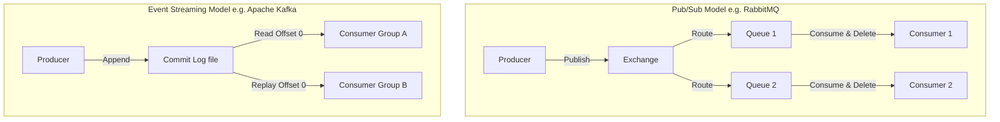

# 🌐 Event-Driven Fundamentals: Paradigms & Comparisons

This document covers the conceptual basics of Event-Driven Architectures (EDA), comparing the core models and popular message brokers.

---

## 🧠 Why Event-Based Design?

Traditional microservice communication relies heavily on **Synchronous HTTP/REST** requests. This introduces **Temporal Coupling**, meaning the caller service cannot complete its work unless the downstream service is active, healthy, and responds immediately.

By adopting an **Event-Driven Architecture (EDA)**, we decouple these systems:
*   **Asynchronous Communication**: Services emit events and proceed with their tasks without waiting for a response.
*   **Temporal Decoupling**: Downstream consumers do not need to be online at the exact moment an event is produced. They process events at their own pace once they are available.
*   **Resiliency**: A failure in a downstream subscriber does not bring down the upstream producer.

---

## 🔀 Two Types of Event-Driven Models

There are two primary models for distributing events across services:

### 1. Publish/Subscribe (Pub/Sub) Model
*   **Core Concept**: Centered around **subscriptions**. Producers publish events to an exchange, which routes them to queues.
*   **Consumption Semantics**: Once a consumer retrieves and acknowledges a message, the broker deletes it.
*   **Replayability**: **None**. Messages cannot be replayed. Any new subscriber joining the system later will only receive new messages and cannot access historical data.
*   **Common Example**: [RabbitMQ](file:///C:/Amit/Work/code/Java/event_driven/kafkaSolutions/doc/rabbitmq_conceptual.md).

### 2. Event Streaming Model
*   **Core Concept**: Centered around a **sequential append-only log**. Producers append events to the end of a log.
*   **Consumption Semantics**: Consumers read messages by tracking their current positions (offsets) in the stream. The broker does *not* delete messages upon consumption.
*   **Replayability**: **High**. Messages are retained for a configurable period (retention policy). Consumers can reset their offsets to replay past events or join late and process the entire stream history.
*   **Common Example**: [Apache Kafka](file:///C:/Amit/Work/code/Java/event_driven/kafkaSolutions/doc/kafka_conceptual.md).

---

## ⚔️ Apache Kafka vs. RabbitMQ: Architectural Comparison

| Feature | Apache Kafka (Event Streaming) | RabbitMQ (Traditional Pub/Sub) |
| :--- | :--- | :--- |
| **Message Persistence** | Persistent. Events are written to an immutable file system log and retained based on time or size configurations. | Transient. Messages are stored temporarily and deleted immediately after successful consumer acknowledgment. |
| **State Management** | **Client-centric**: The consumer group tracks and commits its own read offset back to the broker. | **Broker-centric**: The broker maintains the state of the queues and tracks which messages have been delivered and acknowledged. |
| **Target Consumers** | Broad, stream-centric: Multiple consumer groups can read the exact same events independently. | Specific, queue-centric: Messages are typically routed to specific queues for consumption by individual worker instances. |
| **Scalability & Topology** | Built from the ground up as a distributed, partitioned commit log, facilitating high throughput. | Typically runs as a central broker cluster routing messages dynamically via bindings. |
| **Replayability** | Yes, fully supported by rewinding the offsets. | No, once messages are consumed and acknowledged, they are gone. |

> [!NOTE]
> *   Choose **RabbitMQ** when you need complex, dynamic routing keys, transient work queues, and immediate message deletion.
> *   Choose **Apache Kafka** when you need high-throughput streaming, event replay, long-term log retention, and strict ordering guarantees per partition.
