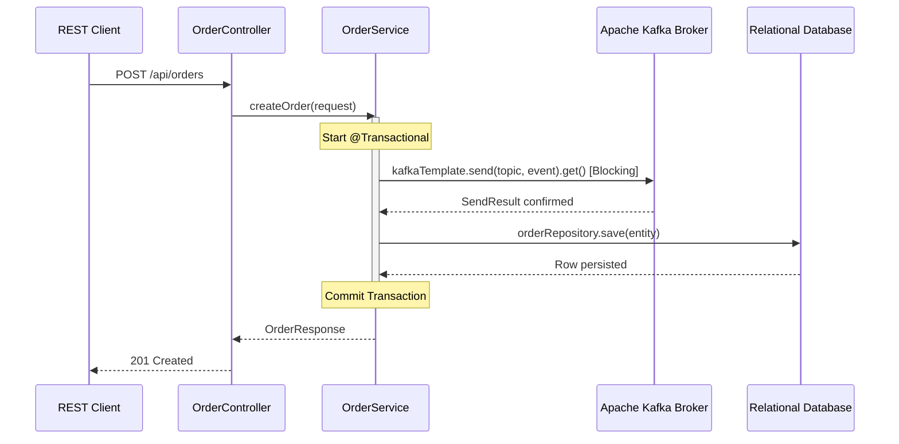

# 🏛 Non-Reactive Order Service Guide

This module demonstrates a traditional, synchronous/blocking architecture using **Spring MVC**, **Spring Data JPA**, and **Spring Kafka**. It contrasts with the reactive/asynchronous patterns in the rest of the workspace by implementing direct, blocking writes and database transactions.

---

## 🏗 System Architecture & Transaction Flow

The service exposes a synchronous REST endpoint and uses JDBC transactions to coordinate database updates and message publishing:



---

## 🕵️‍♂️ Boundary & Consistency Analysis

Because this service utilizes direct synchronous calls within a standard JDBC transaction, it introduces specific consistency guarantees and trade-offs compared to the Transactional Outbox pattern:

### 1. Verification Boundaries
- **Payload Validation**: Enforced at the controller boundary using JSR-303 annotations on the [OrderRequest](file:///C:/Amit/Work/code/Java/event_driven/kafkaSolutions/nonReactiveOrderService/src/main/java/com/saha/amit/nonReactiveOrderService/dto/OrderRequest.java).
- **Transaction Boundary**: Configured around [OrderService.createOrder](file:///C:/Amit/Work/code/Java/event_driven/kafkaSolutions/nonReactiveOrderService/src/main/java/com/saha/amit/nonReactiveOrderService/service/OrderService.java#L36) using `@Transactional`.

### 2. Consistency & The "Dual-Write" Problem
This architecture suffers from the classic distributed transaction ordering issue:
- **If Kafka is offline/slow**: The blocking call `kafkaTemplate.send(...).get()` throws an exception. The database transaction is never committed, and no data is written to the database. (Consistent)
- **If DB Write fails (after Kafka succeeds)**: The event is published to Kafka, but the database write fails or fails during commit. The database transaction rolls back, but the Kafka event cannot be unsent. This creates a **dirty state** where downstream event consumers process an order that does not exist in the source database.

---

## 🧪 Failure & Rollback Scenarios

Below are step-by-step verification procedures to inspect boundaries and transaction rollbacks.

### Scenario A: Kafka Broker Failure (Offline)
1. **Source of Failure**: The Kafka broker is shut down or unreachable.
2. **Behavior**: `kafkaTemplate.send().get()` fails and throws an `ExecutionException`. The exception escapes the `@Transactional` boundary, triggering a rollback.
3. **Rollback Verification**:
   - Query the database to verify no order was written:
     ```sql
     -- Run against your SQL database schema
     SELECT * FROM orders WHERE customer_id = 'test-customer';
     ```
   - *Expected Result*: 0 rows returned. No dirty state is persisted.

### Scenario B: Database Constraint Violation (Post-Kafka Write)
1. **Source of Failure**: The order payload is valid for REST validation, but fails database constraints (e.g. database schema triggers or constraint failures during `orderRepository.save(entity)`).
2. **Behavior**: The Kafka publish succeeds, but the database save throws a JDBC exception. The database transaction rolls back.
3. **Dirty State Verification**:
   - Query the database:
     ```sql
     SELECT * FROM orders WHERE order_id = 'event-uuid-here';
     ```
     *Expected Result*: 0 rows returned (transaction rolled back).
   - Check the Kafka consumer logs or topic contents:
     *Expected Result*: The event has been written to the Kafka topic. Downstream consumers will process the event despite the database rollback.

---

## ⚙️ Configuration & Execution

### Key Configuration Properties
Defined in [application.yml](file:///C:/Amit/Work/code/Java/event_driven/kafkaSolutions/nonReactiveOrderService/src/main/resources/application.yml):
- `spring.kafka.bootstrap-servers`: Address of the target brokers (defaults to localhost:9092, localhost:9093, localhost:9094).
- `order.topic-name`: The destination topic (defaults to `order.events`).
- `spring.datasource.url`: JDBC connection URL for MySQL.

### Run Command
To start this service:
```bash
mvn spring-boot:run -pl nonReactiveOrderService
```
