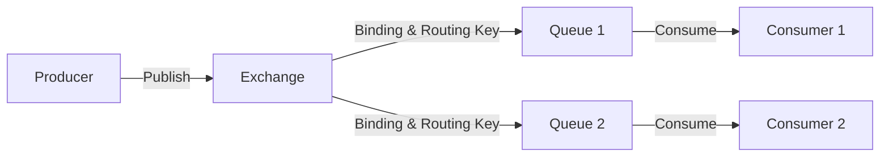
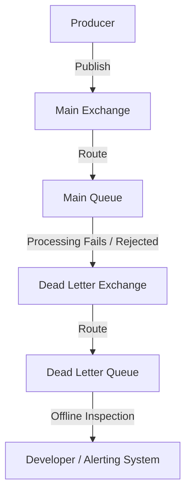

# 🐇 RabbitMQ: Architectural Concepts & Spring Integration

This document details the RabbitMQ messaging model, queue and exchange topologies, dead-lettering mechanisms, and the different patterns to integrate RabbitMQ with Spring Boot applications.

---

## 🏗️ RabbitMQ Topology Building Blocks

RabbitMQ is a message broker that uses a dynamic routing model to pass messages from producers to queues.



### 1. Exchanges
An **Exchange** receives messages from producers and determines how to route them to queues based on routing keys and bindings.

*   **Topic Exchange**: Routes messages based on wildcard matching between the message's routing key and queue binding patterns.
    *   `*` (star) matches exactly one word (e.g., `order.*` matches `order.created` but not `order.created.v1`).
    *   `#` (hash) matches zero or more words (e.g., `order.#` matches `order.created.v1` and `order`).
    *   **Usage**: Business event exchanges where selective subscriptions are needed (e.g., routing `payment.completed` to a different queue than `payment.failed`).
*   **Fanout Exchange**: Ignores routing keys and broadcasts the message to all bound queues.
    *   **Usage**: Event broadcasting to multiple independent services (e.g., logging/auditing), or Dead Letter Exchanges (DLX) where any rejected message should be funneled directly into a dedicated queue.
*   **Direct Exchange**: Routes messages to queues based on an exact match of the routing key.
*   **Headers Exchange**: Routes messages based on message header attributes instead of routing keys.

### 2. Queues
A **Queue** is a buffer that stores messages. Consumers subscribe to queues to pull or receive messages.

### 3. Bindings
A **Binding** is a link that configures a relationship between an exchange and a queue, using routing keys to determine criteria for routing.

---

## ☠️ Dead Letter Queues (DLQ) & Dead Letter Exchanges (DLX)

A **Dead Letter Queue (DLQ)** captures messages that cannot be processed successfully, protecting the system from blocking "poison messages" and ensuring infinite retry loops do not occur.

### How a Message becomes a "Dead Letter":
1.  **Rejection**: A consumer rejects the message using `basic.nack` or `basic.reject` with `requeue=false`.
2.  **TTL Expiry**: The message expires due to a configured Time-To-Live (TTL) limit on the queue (`x-message-ttl`).
3.  **Queue Length Limit**: The message is dropped or dead-lettered because the queue has exceeded its maximum capacity.

### Configuration in RabbitMQ:
You configure the main queue with specific arguments pointing to a DLX:
*   `x-dead-letter-exchange`: The name of the exchange to publish dead messages to.
*   `x-dead-letter-routing-key` (optional): The routing key to apply when the broker forwards the dead message to the DLX.



---

## 🔌 Three Ways to Connect Spring Boot to RabbitMQ

When building Spring Boot services, developers can choose between three different paradigms to interact with RabbitMQ:

### 1️⃣ Reactive Style (Reactor RabbitMQ)
*   **Library**: `io.projectreactor.rabbitmq:reactor-rabbitmq`
*   **Paradigm**: Reactive, asynchronous, non-blocking stream streams.
*   **Core Classes**: `Sender`, `Receiver` (instantiated via `RabbitFlux`).
*   **Example**:
    ```java
    sender.send(Mono.just(new OutboundMessage("exchange", "routingKey", payload.getBytes())))
          .subscribe();
    
    receiver.consumeAutoAck("queue-name")
            .subscribe(delivery -> log.info("Received: {}", new String(delivery.getBody())));
    ```
*   **Pros**: 
    *   Highly scalable with minimal thread overhead (fully non-blocking).
    *   Native integration with WebFlux and reactive streams (backpressure-aware).
*   **Cons**: Low-level API. You must manually handle queue/exchange declarations, message serialization, and retries.
*   **Best For**: High-throughput, low-latency microservices using WebFlux.

### 2️⃣ Imperative Style (Spring AMQP / RabbitTemplate)
*   **Library**: `org.springframework.boot:spring-boot-starter-amqp`
*   **Paradigm**: Blocking, imperative, synchronous operations.
*   **Core Classes**: `RabbitTemplate`, `@RabbitListener`.
*   **Example**:
    ```java
    rabbitTemplate.convertAndSend("exchange", "routingKey", myPayload);
    
    @RabbitListener(queues = "my-queue")
    public void handle(MyPayload message) {
        log.info("Received message: {}", message);
    }
    ```
*   **Pros**: Very Spring-friendly. Includes automatic configuration, built-in retry templates, easy DTO serialization/deserialization, and simple declarative annotations.
*   **Cons**: Blocking execution models. Can lead to worker thread starvation when running inside reactive stacks.
*   **Best For**: Traditional Spring MVC applications or when simple setup is preferred over scalability.

### 3️⃣ Declarative Style (Spring Cloud Stream + Rabbit Binder)
*   **Library**: `org.springframework.cloud:spring-cloud-stream-binder-rabbit`
*   **Paradigm**: Declarative, configuration-driven, functional bindings.
*   **Core Classes**: Java functional interfaces (`Function`, `Consumer`, `Supplier`) mapped as Spring `@Bean`s.
*   **Example**:
    ```java
    @Bean
    public Consumer<MyPayload> processOrder() {
        return payload -> log.info("Processing order payload: {}", payload);
    }
    ```
    *Properties configuration:*
    ```properties
    spring.cloud.function.definition=processOrder
    spring.cloud.stream.bindings.processOrder-in-0.destination=order.exchange
    spring.cloud.stream.bindings.processOrder-in-0.group=order-service-queue
    ```
*   **Pros**:
    *   **Broker Agnostic**: Zero broker-specific imports in the business code. You can switch to Apache Kafka or Amazon Kinesis purely by swapping dependencies and configuration properties.
    *   Handles all broker setup (exchanges, queues, binds, DLQs) automatically behind the scenes.
*   **Cons**: Introduces framework abstraction layers which can make low-level debugging or fine-tuning complex custom AMQP headers harder.
*   **Best For**: Microservice architectures using Spring Cloud, where adaptability, function-as-a-service (FaaS) programming, and standard message processing pipelines are highly valued.
