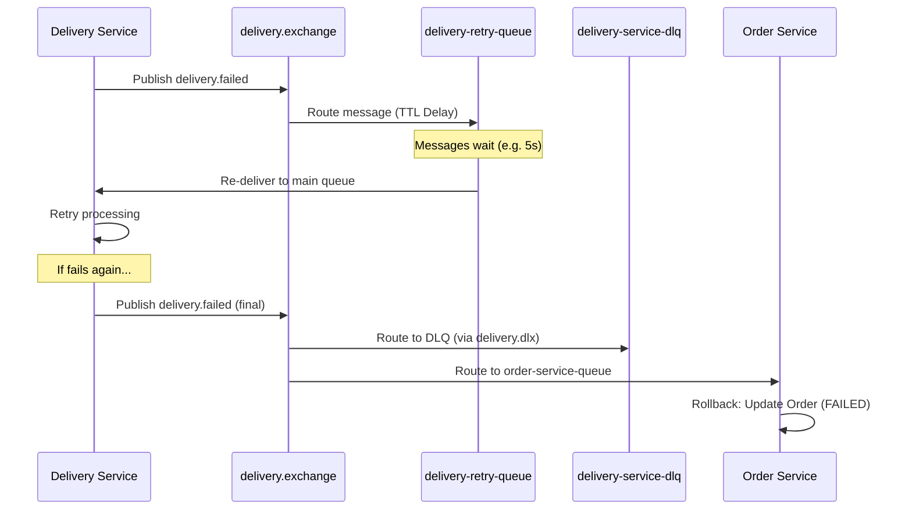

# 🎭 Distributed Saga Pattern: Event-Driven Choreography

This document outlines the design and step-by-step workflow of the distributed **Saga Pattern** implemented via **Event Choreography**.

---

## 🏗️ Choreography vs. Orchestration

In distributed microservice architectures, managing transactions that span multiple services is a critical challenge. The **Saga Pattern** splits a single distributed transaction into a series of local transactions:

```mermaid
graph TD
    subgraph Choreography (Decentralized)
        A[Order Service] -->|order.created| B[Payment Service]
        B -->|payment.completed| C[Delivery Service]
        C -->|delivery.completed| A
    end
```

*   **Choreography**: Each service listens for events from other services and executes its local transactions. Decisions are decentralized.
*   **Orchestration**: A central orchestrator service tells each participant which local transaction to execute.

This repository demonstrates **Choreography**, where coordination is driven purely by event exchanges across topics.

---

## 🗺️ Step-by-Step Saga Flow Matrix

The tables below map the chronological sequence of events, actions, destinations, and routing keys for both the happy path and failure compensation paths.

### 🔹 Scenario A: The Happy Path (Success)
All services complete their local operations successfully, and the order is closed.

| Step | Initiator | Action | Exchange / Topic | Routing Key | Target Consumer | Purpose |
| :--- | :--- | :--- | :--- | :--- | :--- | :--- |
| **1** | Client | POST `/orders` request | — | — | Order Service | Places order, generates UUID, saves order to database. |
| **2** | Order Service | Publish event | `order.exchange` / `orders.v1` | `order.created` | Payment Service | Notifies that a new order has been received. |
| **3** | Payment Service | Consume event | — | `order.created` | — | Starts local payment transaction. |
| **4** | Payment Service | Save Payment | — | — | — | Persists payment state (`INITIATED`). |
| **5** | Payment Service | Publish event | `payment.exchange` / `payments.v1` | `payment.created` | — | Notifies that payment has been initialized. |
| **6** | Payment Service | Complete Payment | — | — | — | Debits customer account, updates status to `COMPLETED`. |
| **7** | Payment Service | Publish event | `payment.exchange` / `payments.v1` | `payment.completed` | Delivery Service | Notifies that payment succeeded. |
| **8** | Delivery Service | Consume event | — | `payment.completed` | — | Starts local delivery scheduling. |
| **9** | Delivery Service | Save Delivery | — | — | — | Persists delivery record (`CREATED`). |
| **10** | Delivery Service | Publish event | `delivery.exchange` | `delivery.created` | — | Notifies that delivery is scheduled. |
| **11** | Delivery Service | Complete Delivery | — | — | — | Physically ships order, updates status to `COMPLETED`. |
| **12** | Delivery Service | Publish event | `delivery.exchange` | `delivery.completed` | Order Service | Notifies that delivery succeeded. |
| **13** | Order Service | Consume event | — | `delivery.completed` | — | Triggers order closure transaction. |
| **14** | Order Service | Close Order | — | — | — | Updates database order status to `CLOSED`. |
| **15** | Order Service | Publish event | `order.exchange` / `orders.v1` | `order.closed` | Analytics / SSE | Notifies that the order lifecycle is successfully finished. |

---

### ❌ Scenario B: Payment Failure (Compensation Flow)
If the customer has insufficient funds, the payment service fails and triggers a compensation event to cancel the order.

| Step | Initiator | Action | Exchange / Topic | Routing Key | Target Consumer | Purpose |
| :--- | :--- | :--- | :--- | :--- | :--- | :--- |
| **1** | Payment Service | Complete Payment | — | — | — | Debits fail (insufficient funds), updates status to `FAILED`. |
| **2** | Payment Service | Publish event | `payment.exchange` | `payment.failed` | Order Service | Notifies payment failure. |
| **3** | Order Service | Consume event | — | `payment.failed` | — | Triggers local compensation transaction. |
| **4** | Order Service | Cancel Order | — | — | — | Updates database order status to `CANCELLED`. |
| **5** | Order Service | Publish event | `order.exchange` | `order.cancelled` | Notification Svc | Notifies customer of cancellation. |

---

### ⚠️ Scenario C: Delivery Failure (Asynchronous Retries & DLQ)
If delivery fails (e.g., courier unavailable), the message is routed to a retry queue with a Time-To-Live (TTL) delay. If retries are exhausted, the delivery fails, triggering order failure.



| Step | Initiator | Action | Exchange / Topic | Routing Key | Target Consumer | Purpose |
| :--- | :--- | :--- | :--- | :--- | :--- | :--- |
| **1** | Delivery Service | Process Delivery | — | — | — | Courier assignment fails, updates status to `FAILED`. |
| **2** | Delivery Service | Publish event | `delivery.exchange` | `delivery.failed` | Retry Queue | Publishes failure details. |
| **3** | Broker | Route message | `delivery.exchange` | `delivery.failed` | `delivery-retry-queue` | Holds message in retry queue with TTL. |
| **4** | Broker | Expire TTL | — | `delivery.retry` | Delivery Service | Redelivers back to main queue for consumption. |
| **5** | Delivery Service | Retry processing | — | — | — | Retries couriers. Fails again. |
| **6** | Delivery Service | Publish final event | `delivery.exchange` | `delivery.failed` | DLQ & Order Service | Notifies of final failure. |
| **7** | Broker | Route to DLQ | `delivery.dlx` | — | `delivery-service-dlq` | Captures message for manual debugging. |
| **8** | Order Service | Consume final event| — | `delivery.failed` | — | Triggers order rollback. |
| **9** | Order Service | Update Order | — | — | — | Updates database order status to `FAILED`. |
| **10** | Order Service | Publish event | `order.exchange` | `order.failed` | Notification Svc | Notifies customer. |

---

## 🔌 Topic & Exchange Topologies

### 🔹 RabbitMQ Configuration
*   **Exchanges**: Topic exchanges (`order.exchange`, `payment.exchange`, `delivery.exchange`) are used for business routing keys, allowing wildcard tracking (`order.*`). Fanout exchanges (`order.dlx`, `payment.dlx`, `delivery.dlx`) are used for Dead Letter Exchanges.
*   **Queues**: Explicit queues are declared per service (e.g., `order-service-queue`, `payment-service-queue`, `delivery-service-queue`).

### 🔹 Apache Kafka Configuration
*   **Logical Topics**: `orders.v1` and `payments.v1`.
*   **Partitioning**: Partition keys are mapped using the `customerId` header. This guarantees that all state transitions for a single customer are processed in strict chronological order by the same partition consumer.
*   **Manual Acknowledgment**: In-memory Hot Sinks handle routing offsets sequentially, ensuring at-least-once transaction execution.
