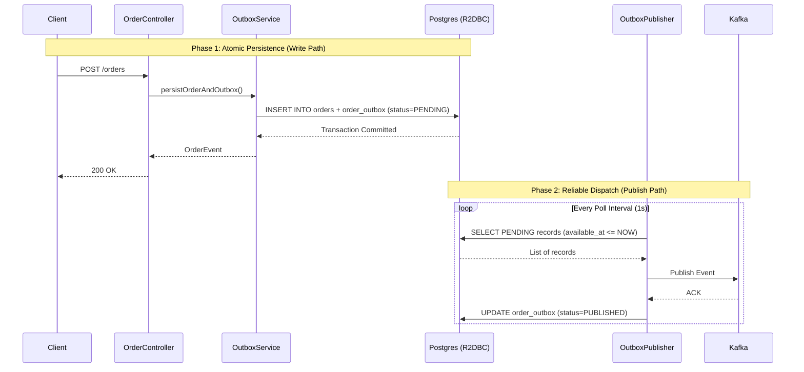

# Order Service Business Logic: Transactional Outbox Deep-Dive

The `reactiveOrderService` ensures reliable, event-driven communication by using the **Transactional Outbox Pattern**. This prevents data inconsistency between the database (order state) and Kafka (event stream).

---

## 🏗️ Workflow Visualization



---

## 🛠️ Implementation Details

### 1. The Write Path (Atomic Transaction)
*   **File:** `OutboxService.java`
*   **Method:** `persistOrderAndOutbox(String customerId, Double amount)`
*   **Logic:** Uses `TransactionalOperator` to ensure that both the `OrderEntity` and the `OrderOutboxEntity` are saved in a single database transaction. If the database save fails, no event is ever queued for Kafka.
*   **Key DB State:** The outbox record is created with:
    *   `status = PENDING`
    *   `available_at = CURRENT_TIMESTAMP`
    *   `attempts = 0`

### 2. The Publish Path (Polling & Dispatch)
*   **File:** `OutboxPublisher.java`
*   **Method:** `publishPendingRecords()`
*   **Logic:** A background task triggered either by a 1-second interval or a manual API call.
*   **The Query:** (in `OrderOutboxRepository.java`)
    ```sql
    SELECT * FROM order_outbox 
    WHERE status <> 'PUBLISHED' 
    AND available_at <= CURRENT_TIMESTAMP 
    LIMIT :batchSize
    ```
*   **Handling Failure:** If a Kafka publish fails, the `updateForRetry` method is called:
    *   The `attempts` count is incremented.
    *   The `available_at` timestamp is moved into the future using **Exponential Backoff** (`2^attempts` seconds).
    *   The record becomes "invisible" to the poller until the new `available_at` time is reached.

---

## ⚙️ Controlling Configurations

The following properties in `application.properties` control the behavior of the Outbox:

| Property | Default | Description |
| :--- | :--- | :--- |
| `app.kafka.outbox.poll-interval` | `PT1S` (1s) | How often the background worker checks the DB for new events. |
| `app.kafka.outbox.batch-size` | `50` | Max number of records to fetch and publish in a single poll cycle. |
| `app.kafka.outbox.max-attempts` | `5` | Max retries for a single event before marking it as `FAILED`. |
| `order.use-protobuf` | `false` | Toggles between JSON and Protobuf serialization for Kafka. |

---

## 🗄️ Database Schema (`order_outbox`)

The flow is driven by the state machine in these columns:

| Column | Role in the Flow |
| :--- | :--- |
| **`status`** | `PENDING` records are picked up; `PUBLISHED` are ignored; `FAILED` are stopped. |
| **`available_at`** | The "Scheduling" column. Records are only picked up if this time is in the past. Used for retries. |
| **`payload`** | The serialized JSON/Protobuf representation of the `OrderEvent`. |
| **`attempts`** | Used to calculate backoff duration and enforce max retries. |
| **`last_error`** | Captures the exception message from Kafka to aid debugging. |

---

## 🚀 Key Components Registry

*   **Trigger (Handshake):** `OrderController.placeOrder()`
*   **Persistence Orchestrator:** `OutboxService.persistOrderAndOutbox()`
*   **Background Poller:** `OutboxPublisher.start()` (using `Flux.interval`)
*   **Kafka Producer:** `OrderEventPublisher.publish()`
*   **State Repository:** `OrderOutboxRepository.findNextBatch()`
