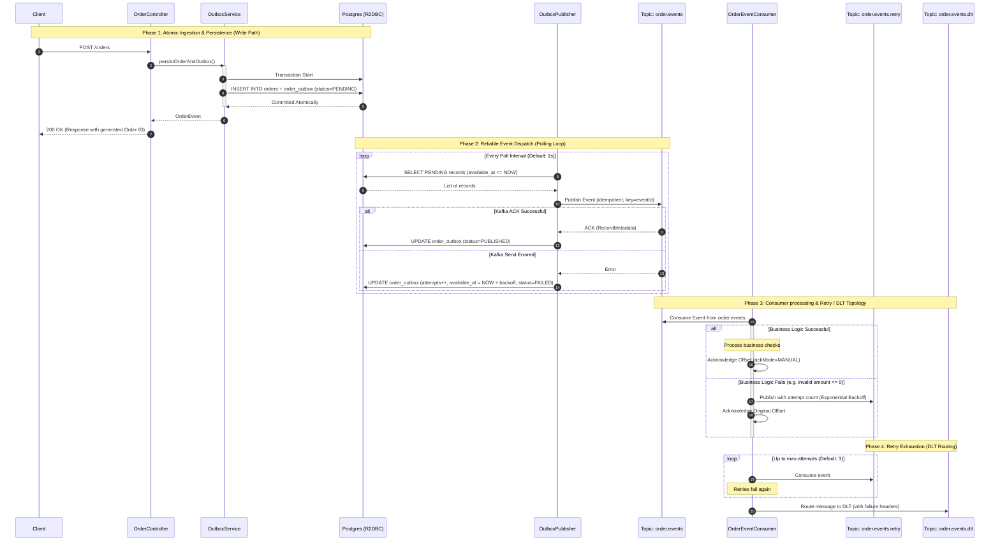

# Order Service: Transactional Outbox & Reactor Kafka Guide

This module demonstrates a **Production-Grade, Fully Reactive Event-Driven Architecture (EDA)** using **Project Reactor**, **Reactor Kafka (io.projectreactor.kafka)**, and the **Transactional Outbox Pattern** with **R2DBC (Reactive Relational Database Connectivity)** on a PostgreSQL database.

By utilizing reactive paradigms from the database driver up to the Kafka broker clients, this service achieves high throughput and low resource utilization under heavy load, ensuring **At-Least-Once event delivery** without blocking connection threads.

---

## 🏗️ System Architecture & Data Flow

The service divides its business logic and event distribution into three distinct reactive pipelines:



### 1. The Write Path (Atomic Persistence)
*   **Key Class:** [OutboxService.java](file:///C:/Amit/Work/code/Java/event_driven/kafkaSolutions/reactiveOrderService/src/main/java/com/saha/amit/reactiveOrderService/service/OutboxService.java)
*   **Method:** `persistOrderAndOutbox(String customerId, Double amount)`
*   **Logic:** Uses Spring's reactive `TransactionalOperator` to bind both `OrderEntity` and `OrderOutboxEntity` inserts into a single atomic database transaction. If the order cannot be persisted, no record is saved in the outbox table, preventing partial failures and outbox-to-database inconsistencies.
*   **Db State:** Creates the outbox record with `status = PENDING`, `available_at = CURRENT_TIMESTAMP`, and `attempts = 0`.

### 2. The Publish Path (Outbox Poller)
*   **Key Class:** [OutboxPublisher.java](file:///C:/Amit/Work/code/Java/event_driven/kafkaSolutions/reactiveOrderService/src/main/java/com/saha/amit/reactiveOrderService/messanger/OutboxPublisher.java)
*   **Method:** `publishPendingRecords()`
*   **Logic:** A background task run on a schedule driven by Reactor's `Flux.interval`. It queries a batch of pending records using:
    ```sql
    SELECT * FROM microservice.order_outbox 
    WHERE status <> 'PUBLISHED' 
    AND available_at <= CURRENT_TIMESTAMP 
    LIMIT :batchSize
    ```
    For each record, it deserializes the payload, sends it to Kafka through the idempotent `jsonKafkaSender`, and transitions the record status:
    *   **Success**: Sets `status = PUBLISHED`.
    *   **Failure**: Increments `attempts`. If `attempts >= maxAttempts`, updates status to `FAILED` and delays the next visibility by 1 hour. If under limits, calculates exponential backoff (`2^attempts` seconds), schedules `available_at` in the future, and flags as `FAILED`.

> [!TIP]
> **Manual Outbox Control in Dev/Testing:**
> To easily inspect the outbox table and verify state changes, the scheduler interval `app.kafka.outbox.poll-interval` can be configured to a very large duration (e.g., `PT1H` or 1 hour). This halts automated sweeps and lets you inspect outbox records in their initial `PENDING` state. To publish them manually, trigger the `POST /orders/outbox/publish` endpoint.

### 3. The Consumer Path (Retry & DLT Orchestration)
*   **Key Class:** [OrderEventConsumer.java](file:///C:/Amit/Work/code/Java/event_driven/kafkaSolutions/reactiveOrderService/src/main/java/com/saha/amit/reactiveOrderService/messanger/OrderEventConsumer.java)
*   **Logic:** Listens to incoming order events. Processes them reactively. If business verification fails:
    *   The event is sent to the retry topic (`order.events.retry`) via [RetryEventPublisher.java](file:///C:/Amit/Work/code/Java/event_driven/kafkaSolutions/reactiveOrderService/src/main/java/com/saha/amit/reactiveOrderService/messanger/RetryEventPublisher.java) using programmatic backoff (`2^attempt` seconds delay before republishing).
    *   If retries are exhausted (exceeding `app.kafka.retry.max-attempts`), the event is forwarded to the Dead-Letter Topic (`order.events.dlt`) by [DltPublisher.java](file:///C:/Amit/Work/code/Java/event_driven/kafkaSolutions/reactiveOrderService/src/main/java/com/saha/amit/reactiveOrderService/messanger/DltPublisher.java) with detailed routing headers (`failure-type`, `failure-reason`, `source-topic`, etc.).
    *   The receiver offset is manually committed *only* after routing to Retry or DLT is complete, safeguarding against message loss.

---

## ⚙️ Controlling Configurations

The following properties configured in [application.properties](file:///C:/Amit/Work/code/Java/event_driven/kafkaSolutions/reactiveOrderService/src/main/resources/application.properties) dictate the runtime behavior of the system:

| Property | Default Value | Description |
| :--- | :--- | :--- |
| `spring.r2dbc.url` | `r2dbc:postgresql://localhost:5432/aidb` | The reactive PostgreSQL database URL. |
| `spring.r2dbc.properties.currentSchema` | `microservice` | The default schema for tables. |
| `spring.kafka.bootstrap-servers` | `localhost:9092` | List of active Kafka brokers. |
| `app.kafka.topic.order` | `order.events` | Main JSON event topic. |
| `app.kafka.topic.order.retry` | `order.events.retry` | Retry topic for delayed consumer retries. |
| `app.kafka.topic.order.dlt` | `order.events.dlt` | Dead-letter topic for exhausted retry events. |
| `app.kafka.topic.order.proto` | `order.events.proto` | Topic used when running in Protobuf mode. |
| `app.kafka.retry.max-attempts` | `3` | Max consumer retry limit before DLT. |
| `app.kafka.outbox.poll-interval` | `PT1S` (1s) | DB poll interval frequency. Can be set to a large value (e.g. `PT1H` for 1 hour) during testing to allow manual outbox inspection. |
| `app.kafka.outbox.batch-size` | `50` | Batch limit per outbox query. |
| `app.kafka.outbox.max-attempts` | `5` | Max publisher retries for Kafka broker down scenarios. |
| `order.use-protobuf` | `false` | Enables Protobuf serialization and disables JSON. |
| `app.kafka.schema-registry-url` | `http://localhost:8081` | Confluent Schema Registry endpoint (for Protobuf serialization). |

---

## 🔀 Serialization Formats: JSON vs. Protobuf

The service supports two modes of message serialization on Kafka, toggled by the `order.use-protobuf` setting.

### Comparison: JSON vs. Protobuf Mode

| Feature | JSON Mode (`order.use-protobuf=false`) | Protobuf Mode (`order.use-protobuf=true`) |
| :--- | :--- | :--- |
| **Topic** | `order.events` | `order.events.proto` |
| **Payload Structure** | Plaintext ASCII/UTF-8 JSON string. | Binary serialization format. |
| **Schema Enforcement** | Loose. The schema is implicit in Java classes; changes require careful coordination but aren't strictly blocked. | Strict. Schema is defined in `order_event.proto` and validated against a schema schema registered with **Confluent Schema Registry**. |
| **Payload Size** | Larger. The keys/field names (e.g. `"eventId"`, `"orderId"`) are repeated in every message text, increasing bandwidth consumption. | Highly compact. Field names are replaced by integer tags, and values are packed into a dense binary layout. |
| **CPU Overhead** | Higher serialization and deserialization CPU cost due to text parsing via Jackson. | Lower CPU overhead due to efficient binary serialization. |
| **Schema Registry** | Not required. | **Required** (configured via `app.kafka.schema-registry-url` at `http://localhost:8081`). |
| **Internal Mapper** | Publishes the domain `OrderEvent` directly. | Maps `OrderEvent` to the compiled protobuf class `OrderEventMessage` via `OrderEventProtoMapper`. |

### Architectural Flow Differences

1. **JSON Serialization Flow**:
   - The background worker `OutboxPublisher` fetches the outbox record, deserializes the JSON database payload back to `OrderEvent`, and passes it to `OrderEventPublisher`.
   - `OrderEventPublisher` uses `jsonKafkaSender` with a custom inline serializer `(topic, data) -> serializeEvent(...)` that writes JSON bytes.
   - The consumer `OrderEventConsumer` subscribes to the main topic `order.events` and retry topic `order.events.retry`, deserializing using Jackson.

2. **Protobuf Serialization Flow**:
   - The background worker `OutboxPublisher` fetches the outbox record, deserializes the JSON database payload, and passes it to `OrderEventPublisher` with the `useProtobuf` flag set to `true`.
   - `OrderEventPublisher` maps the event to `OrderEventMessage` (compiled Protobuf class) using `OrderEventProtoMapper.toProto(event)`.
   - The message is published to `order.events.proto` using `protobufKafkaSender` configured with `KafkaProtobufSerializer`.
   - The serializer registers the schema (`order_event.proto`) dynamically with the Schema Registry (on port `8081`).
   - The consumer `OrderEventConsumer` subscribes to the protobuf topic `order.events.proto` using `protobufKafkaReceiver` configured with `KafkaProtobufDeserializer` and the target Specific Record class `OrderEventMessage`.

### How to Switch Between Formats

To toggle the active serialization format in the application, do the following:

#### 1. JSON Mode (Default Configuration)
1. In [application.properties](file:///C:/Amit/Work/code/Java/event_driven/kafkaSolutions/reactiveOrderService/src/main/resources/application.properties), ensure the property is set to `false`:
   ```properties
   order.use-protobuf=false
   ```
2. Run standard Kafka (e.g. using `doc/docker-compose.yaml`).
3. Restart the service.

#### 2. Protobuf Mode
1. Ensure a Schema Registry instance is running alongside your Kafka brokers:
   ```bash
   docker compose -f doc/docker-compose-kafka-schema-registry.yaml up -d
   ```
2. In [application.properties](file:///C:/Amit/Work/code/Java/event_driven/kafkaSolutions/reactiveOrderService/src/main/resources/application.properties), set:
   ```properties
   order.use-protobuf=true
   ```
   *(Alternatively, launch the application with the environment variable `ORDER_USE_PROTOBUF=true`)*.
3. Restart the service. The service will automatically register the Protobuf schemas with the Schema Registry at `http://localhost:8081`.

---

## 🗄️ Database Schema & Role Mapping

The transactional outbox relies on the schema declared in [schema.sql](file:///C:/Amit/Work/code/Java/event_driven/kafkaSolutions/reactiveOrderService/src/main/resources/schema.sql). 

### 1. `microservice.orders`
Holds the operational states of client orders.
*   `order_id`: UUID primary key.
*   `customer_id`: Reference identifier for partitioning.
*   `amount`: Total cost of order (discounted).
*   `status`: Operational state (`PLACED`, `COMPLETED`, etc.).

### 2. `microservice.order_outbox`
Serves as the persistent event queue.
*   `id`: Event UUID.
*   `aggregate_id`: Relates the event to the order ID.
*   `event_type`: Class name descriptor (e.g. `OrderEvent`).
*   `payload`: Serialized event string (JSON structure).
*   `status`: State machine value (`PENDING`, `PUBLISHED`, `FAILED`).
*   `available_at`: Delayed timestamp used for retry spacing and visibility.
*   `attempts`: Attempt tracker.
*   `last_error`: Standard exception trace snippet for operations monitoring.

> [!IMPORTANT]
> **Performance Index Tuning:**
> To prevent heavy sequential table scans during polling, the index `microservice.idx_order_outbox_status_available` is defined on `(status, available_at)`. This ensures index-seek performance when filtering for unsent, visible events under heavy volume.

---

## 🗺 API Endpoints

| Endpoint | Method | Technical Pattern | Description | Test Script |
| :--- | :--- | :--- | :--- | :--- |
| `/orders` | `POST` | `Mono<OrderResponse>` | Places a new order, triggering reactive atomic outbox saving. | [test_order_service.sh](file:///C:/Amit/Work/code/Java/event_driven/kafkaSolutions/reactiveOrderService/test_order_service.sh) |
| `/orders` | `GET` | `Flux<OrderResponse>` | Retrieves all orders or filters them by `customerId` query parameter. | [test_order_service.sh](file:///C:/Amit/Work/code/Java/event_driven/kafkaSolutions/reactiveOrderService/test_order_service.sh) |
| `/orders/{orderId}` | `GET` | `Mono<ResponseEntity>` | Returns details of a specific order by ID. Returns `404 Not Found` if missing. | [test_order_service.sh](file:///C:/Amit/Work/code/Java/event_driven/kafkaSolutions/reactiveOrderService/test_order_service.sh) |
| `/orders/outbox/publish` | `POST` | `Mono<ResponseEntity>` | Programmatically triggers a manual outbox polling cycle. | [test_order_service.sh](file:///C:/Amit/Work/code/Java/event_driven/kafkaSolutions/reactiveOrderService/test_order_service.sh) |

---

## 🕵️‍♂️ How to Verify the Flow

Perform the following steps to verify database transaction atomicity, Kafka publishing, and consumer retry/DLQ behaviors.

### Step 1: Pre-requisites
1.  **Start Kafka & Schema Registry** (using the standalone stack in detached mode): Run from the project root
    ```bash
    docker compose -f doc/docker-compose-kafka-schema-registry.yaml up -d
    ```
2.  **Start PostgreSQL**: Ensure you have PostgreSQL running on port `5432` with database `aidb`, username `aiuser`, and password `aipass`.
3.  **Run Schema DDL**: Execute the script at [schema.sql](file:///C:/Amit/Work/code/Java/event_driven/kafkaSolutions/reactiveOrderService/src/main/resources/schema.sql) against your PostgreSQL database to construct the schema.
4.  **Verify Kafka Topics**: Verify if the required topics are present inside the running `kafka1` container:
    ```bash
    docker exec -it kafka1 kafka-topics --list --bootstrap-server kafka1:19092
    ```
    If the required topics (`order.events`, `order.events.retry`, `order.events.dlt`, `order.events.proto`) are not present, create them by running the commands from [kafka.sh](file:///C:/Amit/Work/code/Java/event_driven/kafkaSolutions/doc/kafka.sh).

### Step 2: Boot the Service
Compile and run the Spring Boot application from the project root:
```bash
mvn clean spring-boot:run -pl reactiveOrderService
```
The server will start up on port `8080`.

### Step 3: Run the Monitors
1.  **Monitor the Kafka topic**: Start a console consumer to tail the main topic:
    ```bash
    docker exec -it kafka1 kafka-console-consumer \
      --bootstrap-server kafka1:19092 \
      --topic order.events \
      --from-beginning \
      --property print.key=true \
      --property print.value=true \
      --property print.headers=true
    ```
2.  **Monitor the Database outbox status**: Open your PostgreSQL client, connect to `aidb`, and query the outbox table to see pending or dispatched records:
    ```sql
    SELECT id, status, attempts, available_at FROM microservice.order_outbox;
    ```

### Step 4: Execute the Verification Scenarios

You can verify the flows manually with the following detailed steps:

#### Path A: Ingest a Valid Order (Atomic persistence -> Publish -> Consumption)
1.  Submit a valid order payload:
    ```bash
    curl -X POST 'http://localhost:8080/orders' \
      -H 'Content-Type: application/json' \
      -d '{"customerId":"8", "amount":200.00}'
    ```
2.  **Verify the Write Path Response**:
    *   The API returns HTTP `200 OK` with the created order JSON.
    *   The controller applies the configured `5%` discount, reducing the amount from `200.00` to `190.00`.
    *   The response contains `"status":"PLACED"` and a auto-generated `"orderId"`.
3.  **Verify DB state transitions**:
    *   Run the query to verify that the order was written to the orders table:
        ```sql
        SELECT order_id, customer_id, amount, status FROM microservice.orders WHERE customer_id = 'CUST-100';
        ```
        *(Should return 1 row with `amount=190.00` and `status=PLACED`)*.
    *   Run the query to verify the outbox entry:
        ```sql
        SELECT id, aggregate_id, status, attempts FROM microservice.order_outbox;
        ```
        *   **Initially**: Since the automated scheduler is configured to poll at a very large interval (e.g. `PT1H` / 1 hour) in development to allow manual status change inspection, you will see the outbox row with `status='PENDING'` and `attempts=0`.
4.  **Manually Trigger Outbox Dispatch**:
    *   Trigger the outbox publisher manually by posting to the outbox publish endpoint:
        ```bash
        curl -X POST 'http://localhost:8080/orders/outbox/publish'
        ```
        *(Expected response: `{"message":"Outbox publishing triggered successfully"}`)*.
    *   Re-run the database status query:
        ```sql
        SELECT id, aggregate_id, status, attempts FROM microservice.order_outbox;
        ```
        *(The row `status` will now have transitioned to `'PUBLISHED'` and the `attempts` count incremented to `1`)*.
5.  **Verify Kafka Event**:
    *   Observe the monitor console consumer window running the `kafka-console-consumer`.
    *   A message matching the order payload will print as follows:
        ```json
        {"eventId":"[UUID]","orderId":"[UUID]","customerId":"8","amount":190.0,"status":"PLACED"}
        ```
6.  **Verify Application logs**:
    *   Look at the console log output of the running Spring Boot application. It will trace:
        *   `✅ Order [UUID] and Outbox [UUID] persisted successfully` (Atomic transaction committed)
        *   `Manual outbox publish triggered via API`
        *   `🔍 Found 1 pending outbox records to publish`
        *   `Outbox record id=[UUID] published successfully`
        *   `Processing order event for orderId=[UUID] customerId=8 amount=190.0` (Event consumed)

#### Path B: Ingest an Invalid Order (Atomic persistence validation check)
1.  Submit an order with an invalid negative amount:
    ```bash
    curl -i -X POST 'http://localhost:8080/orders' \
      -H 'Content-Type: application/json' \
      -d '{"customerId":"CUST-ERR", "amount":-50.00}'
    ```
2.  **Verify Result**: The API returns an internal error code (`500`).
3.  **Verify Atomicity**:
    *   Query the orders table:
        ```sql
        SELECT * FROM microservice.orders WHERE customer_id = 'CUST-ERR';
        ```
        *(Should return 0 rows)*.
    *   Query the outbox table:
        ```sql
        SELECT * FROM microservice.order_outbox WHERE status = 'PENDING';
        ```
        *(Should return 0 rows)*.
    *   This confirms R2DBC automatically rolled back the transaction, guaranteeing that no partial or mismatched database state was written.

#### Path C: Trigger Consumer Retry and DLT (Consumer Resiliency Check)
Since HTTP endpoints validate the values before hitting the database, we must push a "poison event" directly onto the Kafka topic to bypass HTTP validation and trigger the consumer-side retry and Dead Letter Topic flow.
1.  **Monitor the DLT topic**: Open a new terminal window and start a console consumer on the Dead Letter Topic:
    ```bash
    docker exec -it kafka1 kafka-console-consumer \
      --bootstrap-server kafka1:19092 \
      --topic order.events.dlt \
      --from-beginning \
      --property print.key=true \
      --property print.value=true \
      --property print.headers=true
    ```
2.  **Monitor the Retry topic**: Start a console consumer on the Retry topic in another window:
    ```bash
    docker exec -it kafka1 kafka-console-consumer \
      --bootstrap-server kafka1:19092 \
      --topic order.events.retry \
      --from-beginning \
      --property print.key=true \
      --property print.value=true \
      --property print.headers=true
    ```
3.  **Produce a poison payload manually**: Run a producer command and paste a payload with an invalid amount (e.g. `-10.0`):
    ```bash
    echo 'POISON-KEY:{"eventId":"POISON-EVT-100","orderId":"POISON-ORD-100","customerId":"CUST-POISON","amount":-10.00,"status":"PLACED"}' | \
    docker exec -i kafka1 kafka-console-producer \
      --bootstrap-server kafka1:19092 \
      --topic order.events \
      --property parse.key=true \
      --property key.separator=:
    ```
4.  **Observe Consumer Retry Steps**:
    *   The application receives the message on `order.events`. The business checks fail (`amount <= 0`).
    *   Watch the application logs. You will see:
        *   `Failed to process eventId=POISON-EVT-100 attempt=0 reason=Invalid amount: -10.0`
        *   `Scheduling retry attempt 1 for eventId=POISON-EVT-100 after 2000ms` (Exponential backoff delay)
        *   *(A message is produced to `order.events.retry` and is visible in your retry consumer monitor)*.
    *   After 2 seconds, the application consumes the retry message:
        *   `Failed to process eventId=POISON-EVT-100 attempt=1 reason=Invalid amount: -10.0`
        *   `Scheduling retry attempt 2 for eventId=POISON-EVT-100 after 4000ms`
    *   After another 4 seconds:
        *   `Failed to process eventId=POISON-EVT-100 attempt=2 reason=Invalid amount: -10.0`
        *   `Scheduling retry attempt 3 for eventId=POISON-EVT-100 after 8000ms`
    *   After another 8 seconds (the final retry attempt):
        *   `Failed to process eventId=POISON-EVT-100 attempt=3 reason=Invalid amount: -10.0`
        *   `Exhausted retries for eventId=POISON-EVT-100, routing to DLT`
5.  **Verify DLT Consumer Output**:
    *   Check your DLT console consumer monitor window. The poison event will appear.
    *   Inspect the message metadata and headers. It will contain headers mapping the failure reasons:
        *   `source-topic = order.events`
        *   `failure-type = IllegalArgumentException`
        *   `failure-reason = Invalid amount: -10.0`

#### Path D: Testing Protobuf Mode
1.  **Change application configuration**: In [application.properties](file:///C:/Amit/Work/code/Java/event_driven/kafkaSolutions/reactiveOrderService/src/main/resources/application.properties), set:
    ```properties
    order.use-protobuf=true
    ```
2.  **Monitor the Protobuf topic**: Start a schema-aware console consumer on the Protobuf topic to properly decode binary messages:
    ```bash
    docker exec -it schema-registry kafka-protobuf-console-consumer \
      --bootstrap-server kafka1:19092 \
      --topic order.events.proto \
      --from-beginning \
      --property schema.registry.url=http://localhost:8081
    ```
    *(Note: Standard `kafka-console-consumer` on `order.events` will receive no events in Protobuf mode. If run directly on `order.events.proto`, it will output garbled binary payloads instead of readable json-like shapes).*
3.  **Restart the service** and place a valid order:
    ```bash
    curl -X POST 'http://localhost:8080/orders' \
      -H 'Content-Type: application/json' \
      -d '{"customerId":"CUST-200", "amount":100.00}'
    ```
4.  **Manually Trigger Outbox Dispatch**:
    *   Since the poll-interval is configured to a large value (e.g. 1 hour) in development, trigger the outbox publisher manually to send the message:
        ```bash
        curl -X POST 'http://localhost:8080/orders/outbox/publish'
        ```
5.  **Verify Serialization**:
    *   The service maps the order to a compiled Protobuf class using `OrderEventProtoMapper` and serializes it using `KafkaProtobufSerializer`.
    *   The message will be published to the `order.events.proto` topic, and the schema will register dynamically with the Schema Registry at `localhost:8081`.

---

## 🌟 Production Patterns Demonstrated

### 1. Manual Acknowledgment (`ackMode=MANUAL`)
Rather than relying on auto-commit, which commits offsets asynchronously and can cause message loss on crashes, the service uses `commitInterval(Duration.ZERO)` in [KafkaConfig.java](file:///C:/Amit/Work/code/Java/event_driven/kafkaSolutions/reactiveOrderService/src/main/java/com/saha/amit/reactiveOrderService/configuration/KafkaConfig.java). Offsets are manually acknowledged *only* when the consumer pipeline successfully completes processing (`record.receiverOffset()::acknowledge`).

### 2. Transactional Outbox Pattern
Ensures data consistency between database and message broker:
1.  **Atomic Transaction**: DB state change + Event generation occur in one transaction. Using `org.springframework.transaction.reactive.TransactionalOperator`, the service guarantees that either both the order and outbox record are persisted, or neither is. The Event is just returned as response at this point, without being sent to Kafka yet. Same event is stored in the outbox table as a JSON in column 'payload'. And will be later picked up by the background poller for Kafka publishing.
2.  **Asynchronous Dispatch**: A poller publishes these events to Kafka. If Kafka is down, the database state is unaffected and the poller will retry until Kafka becomes available.

### 3. Non-blocking Exponential Backoff Retry Topics
Rather than locking up a consumer thread by sleeping during retries (which halts the ingestion pipeline), failed messages are scheduled to go to the `order.events.retry` topic with a calculated delay. By using `Mono.delay(backoff)` programmatically before sending, we achieve clean asynchronous sleep states.

### 4. Sequential Polling & At-Least-Once Delivery Guarantees
To prevent race conditions in high-throughput or latency-sensitive scenarios, the Outbox Publisher is designed with sequential execution constraints:
*   **Sequential Dispatch (`concatMap`)**: In [OutboxPublisher.java](file:///C:/Amit/Work/code/Java/event_driven/kafkaSolutions/reactiveOrderService/src/main/java/com/saha/amit/reactiveOrderService/messanger/OutboxPublisher.java), the scheduler uses `.concatMap(tick -> publishPendingRecords())` over the polling interval instead of `.flatMap(...)`. This prevents concurrent polling threads from querying the database simultaneously and fetching the same `PENDING` events (due to lacking transactional locks like `FOR UPDATE SKIP LOCKED`), avoiding duplicate Kafka publishing during transient broker latencies.
*   **Deduplication & Idempotency**: Because Kafka guarantees at-least-once delivery, transient errors (e.g. database updates failing after successful Kafka publishes) can still cause duplicate events. The consumer must implement idempotency checks using the unique `eventId` key in the message payload or headers to deduplicate processing on the receiver side.

---

## 🤔 Reactive Webflux & Reactor Kafka vs. Spring Cloud Stream

This module uses raw **Reactor Kafka** directly rather than **Spring Cloud Stream**. 

### Raw Reactor Kafka (Used in this service)
*   **Strengths**: Provides total programmatic control over reactive stream creation. You specify exactly how messages are buffered, when manual offsets are updated, the pipeline scheduling threads, and exact reactive mappings (like `concatMap` to preserve ordering).
*   **Weaknesses**: Requires significant boilerplate code. You must write configuration classes ([KafkaConfig.java](file:///C:/Amit/Work/code/Java/event_driven/kafkaSolutions/reactiveOrderService/src/main/java/com/saha/amit/reactiveOrderService/configuration/KafkaConfig.java)) mapping deserializers and handle consumer loop lifecycle management manually.

### Spring Cloud Stream (Used in `orderServiceFunctions`)
*   **Strengths**: Zero boilerplate. You simply define functional beans (`Supplier`, `Function`, `Consumer`) and configure bindings through property files. It is broker-agnostic, meaning you can swap Kafka for RabbitMQ purely through properties.
*   **Weaknesses**: Replaces fine-grained program control with framework abstractions, making it harder to customize advanced reactive scheduler contexts or custom offset tracking pipelines.
