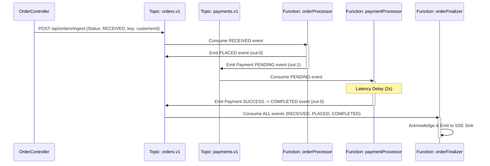

# Order Service: Saga Pattern (Choreography) Guide

This module demonstrates a **Production-Grade Event-Driven Architecture (EDA)** using **Spring Cloud Stream**, **Spring Cloud Function**, and **Apache Kafka**. It builds upon the patterns in [orderServiceFunctions](file:///C:/Amit/Work/code/Java/event_driven/kafkaSolutions/spring-cloud-stream/orderServiceFunctions) to implement the Saga Pattern (Event Choreography) using declarative multiple output bindings.

---

## 🏗 System Architecture & Data Flow (Saga Pattern)

The service coordinates a multi-stage **Event Choreography (Saga)** workflow, transitioning an order through various states via Kafka topics.
Mermaid Diagram illustrates the flow:


### 1. Ingestion Pipeline (`HTTP -> orders.v1`)
- **Trigger**: An HTTP `POST` request to `/api/orders/ingest`.
- **Logic**: Validates the payload. Passes validation: sets status to `RECEIVED`. Fails validation: sets status to `VALIDATION_FAILED`.
- **Output**: Publishes to `orders.v1` using `customerId` as the partition key.

### 2. Workflow Step 1: Order Processor (`orders.v1 -> orders.v1 & payments.v1`)
- **Function**: `orderProcessor` in [OrderFunctions.java](file:///C:/Amit/Work/code/Java/event_driven/kafkaSolutions/spring-cloud-stream/orderServiceFunctionsSaga/src/main/java/com/saha/amit/orderServiceFunctions/functions/OrderFunctions.java)
- **Trigger**: Consumes `RECEIVED` events from `orders.v1`.
- **Logic**: 
    - Updates order state to `PLACED` and emits this back to `orders.v1` via Output Index 0.
    - Generates a `PaymentEvent` (status `PENDING`) and emits this to `payments.v1` via Output Index 1.
    - Uses **Manual Acknowledgment** (`ackMode=MANUAL`).
- **Output**: Purely declarative multiple outputs via `Tuple2<Flux<Message<OrderEvent>>, Flux<Message<PaymentEvent>>>`:
    - `orderProcessor-out-0` binds to the `orders.v1` topic to publish state transitions.
    - `orderProcessor-out-1` binds to the `payments.v1` topic to trigger downstream payments.

### 3. Workflow Step 2: Payment Processor (`payments.v1 -> orders.v1`)
- **Function**: `paymentProcessor` in [OrderFunctions.java](file:///C:/Amit/Work/code/Java/event_driven/kafkaSolutions/spring-cloud-stream/orderServiceFunctionsSaga/src/main/java/com/saha/amit/orderServiceFunctions/functions/OrderFunctions.java)
- **Trigger**: Consumes events from `payments.v1`.
- **Logic**: Simulates payment processing latency (2 seconds). Upon success, it updates the original order state to `COMPLETED`.
- **Output**: Publishes an `OrderEvent` with status `COMPLETED` back to `orders.v1`.

### 4. Workflow Sink: Order Finalizer (`orders.v1 -> SSE Sink`)
- **Function**: `orderFinalizer` in [OrderFunctions.java](file:///C:/Amit/Work/code/Java/event_driven/kafkaSolutions/spring-cloud-stream/orderServiceFunctionsSaga/src/main/java/com/saha/amit/orderServiceFunctions/functions/OrderFunctions.java)
- **Trigger**: Consumes ALL events from `orders.v1` (i.e., `RECEIVED`, `PLACED`, `COMPLETED`).
- **Logic**: Acknowledges the offset and broadcasts the real-time state change to an internal **Reactive Hot Sink**.
- **Output**: Broadcasts the state to active Server-Sent Event (SSE) subscribers via `GET /api/orders/stream`.

---

## 🗺 API Endpoints

| Endpoint | Method | Technical Pattern | Description | Test Script |
| :--- | :--- | :--- | :--- | :--- |
| `/api/orders/ingest` | `POST` | `Flux<Req> -> Flux<Msg>`| Ingests orders into the Kafka system. | [test_order_service.sh](file:///C:/Amit/Work/code/Java/event_driven/kafkaSolutions/spring-cloud-stream/orderServiceFunctionsSaga/test_order_service.sh) |
| `/api/orders/stream` | `GET` | **Hot Sink (SSE)** | Live stream of processed order events. | [test_order_service.sh](file:///C:/Amit/Work/code/Java/event_driven/kafkaSolutions/spring-cloud-stream/orderServiceFunctionsSaga/test_order_service.sh) |

---

## 🕵️‍♂️ How to Verify the Saga Flow

To observe the choreography of the Saga pattern, you can monitor the state transitions across both the `orders.v1` and `payments.v1` topics, alongside the Server-Sent Event (SSE) stream.

### Step 1: Open the Monitors
Open separate terminal windows to monitor the system components:

**Terminal 1: Subscribe to the Live SSE Stream**
This streams the finalized events processed by `orderFinalizer`.
```bash
curl -N 'http://localhost:8080/api/orders/stream'
```

**Terminal 2: Monitor the `orders.v1` Kafka Topic**
This displays the order state changes. Run from the project root:
```bash
docker exec -it kafka1 kafka-console-consumer \
  --bootstrap-server kafka1:19092 \
  --topic orders.v1 \
  --property print.key=true \
  --property print.headers=true
```

**Terminal 3: Monitor the `payments.v1` Kafka Topic**
This displays the payment events emitted by the `orderProcessor`. Run from the project root:
```bash
docker exec -it kafka1 kafka-console-consumer \
  --bootstrap-server kafka1:19092 \
  --topic payments.v1 \
  --property print.key=true \
  --property print.headers=true
```

### Step 2: Trigger a Successful Saga Workflow
Use curl or PowerShell to post a valid order payload:

**Using bash/curl:**
```bash
curl -X POST 'http://localhost:8080/api/orders/ingest' \
  -H 'Content-Type: application/json' \
  -d '[{"orderId":"ORD-SAGA-100", "customerId":"CUST-A", "customerName":"Alice", "amount":150.00}]'
```

**Using PowerShell:**
```powershell
Invoke-RestMethod -Uri 'http://localhost:8080/api/orders/ingest' -Method Post -ContentType 'application/json' -Body '[{"orderId":"ORD-SAGA-100", "customerId":"CUST-A", "customerName":"Alice", "amount":150.00}]'
```

#### What you should see:
1. **API Response**: You will get a `200 OK` listing the order as `RECEIVED`.
2. **Terminal 2 (`orders.v1` Topic)**: You will see three events appear in sequence for `ORD-SAGA-100`:
   * Status `RECEIVED` (Ingested from Controller)
   * Status `PLACED` (Emitted by `orderProcessor` via Output 0)
   * Status `COMPLETED` (Emitted by `paymentProcessor` via Output 0 after successful payment completion)
3. **Terminal 3 (`payments.v1` Topic)**: You will see one payment event with status `PENDING` emitted by `orderProcessor` (via Output 1).
4. **Application Logs**: You will see:
   * `[Workflow] Step 1: Order ORD-SAGA-100 RECEIVED. Updating status to PLACED...`
   * `[Workflow] Step 2: Triggering Payment for Order ORD-SAGA-100`
   * `[Workflow] Step 3: Payment SUCCESS for Order ORD-SAGA-100. Completing Order...`
   * `[Sink] Order ORD-SAGA-100 status updated to: COMPLETED`
5. **Terminal 1 (SSE Stream)**: You will see the events stream in real-time as they are processed by the finalizer.

---

## 🌟 Production Patterns & Architectural Choices

### 1. Manual Acknowledgment (`ackMode=MANUAL`)
Unlike standard auto-commit, this service uses manual ACKs. This ensures "At-Least-Once" delivery semantics: we only tell Kafka we're done *after* our business logic has finished successfully.

### 2. Dead Letter Topic (DLT)
Any message that fails processing after **3 retry attempts** (configured with exponential backoff) is automatically moved to the `orders.v1.DLT` topic for manual inspection and recovery.

### 3. Smart Partitioning Strategy (SpEL & Serialization Pitfall)
We explicitly route events using `customerId` as the partition key.

> [!IMPORTANT]
> **Reactive Serialization Pitfall & Resolution:**
> In reactive setups, Spring Cloud Stream serializes the outbound message payload into a JSON byte array (`byte[]`) *before* the SpEL partitioning expression is evaluated.
>
> If we configure:
> `spring.cloud.stream.bindings.ingestOrders-out-0.producer.partitionKeyExpression=payload.customerId`
>
> The evaluation fails with:
> `SpelEvaluationException: EL1008E: Property or field 'customerId' cannot be found on object of type 'byte[]'`
>
> **Solution**:
> 1. Set the partition key in Java code via `KafkaHeaders.KEY` headers:
>    ```java
>    MessageBuilder.withPayload(event).setHeader(KafkaHeaders.KEY, event.getCustomerId())
>    ```
> 2. Configure the property file to route using the header instead of the payload:
>    ```properties
>    spring.cloud.stream.bindings.ingestOrders-out-0.producer.partitionKeyExpression=headers['kafka_messageKey']
>    ```
> This accesses the un-serialized Java String key from the headers, guaranteeing partition routing without deserialization issues.

### 4. Declarative Multi-Destination Output Bindings (`Tuple2`)
Rather than relying on `StreamBridge` inside a function (which is an imperative escape hatch), we implement declarative multiple outputs using Reactor `Tuple2`:
```java
@Bean
public Function<Flux<Message<OrderEvent>>, Tuple2<Flux<Message<OrderEvent>>, Flux<Message<PaymentEvent>>>> orderProcessor()
```
Spring Cloud Stream binds each `Flux` to a corresponding logical binding:
- `orderProcessor-out-0` mapped to `orders.v1` via `Tuple2.getT1()`
- `orderProcessor-out-1` mapped to `payments.v1` via `Tuple2.getT2()`

This keeps our processor purely functional, side-effect free, and fully testable.

### 5. Reactive Hot Sink
The service maintains a `Sinks.Many<OrderEvent>` which acts as a bridge between the asynchronous Kafka consumer and the real-time HTTP SSE stream.

---

## 🤔 The Spring Cloud Stream Advantage

Instead of writing explicit `KafkaTemplate.send()` or `@KafkaListener` logic, you simply write pure Java functions:

```java
// Producer
@Bean
public Function<Flux<OrderRequest>, Flux<Message<OrderEvent>>> ingestOrders() { ... }

// Multi-Output Processor
@Bean
public Function<Flux<Message<OrderEvent>>, Tuple2<Flux<Message<OrderEvent>>, Flux<Message<PaymentEvent>>>> orderProcessor() { ... }
```

Then, map these functions to Kafka topics in [application.properties](file:///C:/Amit/Work/code/Java/event_driven/kafkaSolutions/spring-cloud-stream/orderServiceFunctionsSaga/src/main/resources/application.properties):
```properties
# Route outputs of orderProcessor
spring.cloud.stream.bindings.orderProcessor-out-0.destination=orders.v1
spring.cloud.stream.bindings.orderProcessor-out-1.destination=payments.v1
```

---

## 🏗 Topic Management Strategy

In the source code, you will find [KafkaTopicsConfig.java](file:///C:/Amit/Work/code/Java/event_driven/kafkaSolutions/spring-cloud-stream/orderServiceFunctionsSaga/src/main/java/com/saha/amit/orderServiceFunctions/config/KafkaTopicsConfig.java) with its `@Configuration` annotation **commented out**. 

Topic creation should be managed by infrastructure tools (like Terraform or [kafka.sh](file:///C:/Amit/Work/code/Java/event_driven/kafkaSolutions/doc/kafka.sh)) rather than Java code to ensure partition counts, replication factors, and retention policies are correctly configured and controlled.
